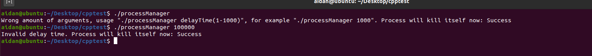
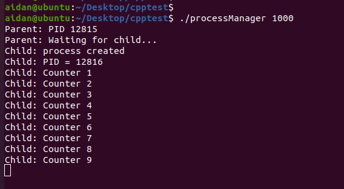
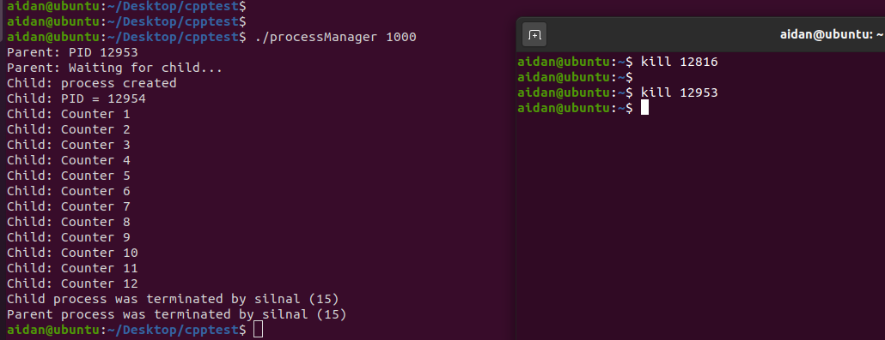

# TestTaskGL
Test task using C++

If user tries to enter incorrect value of delay time or doesn not enter delay value at all, he will see error message and process will be terminated. 
 

Correct start of process with value of 1000 ms. Child process starts to increase counter by 1. 
 
If child process was terminated using kill, then parent process starts child process again and counter continues using last succesfull value of counter. 

If parent was terminated using kill, first of all child process will be terminated and then parent process.

